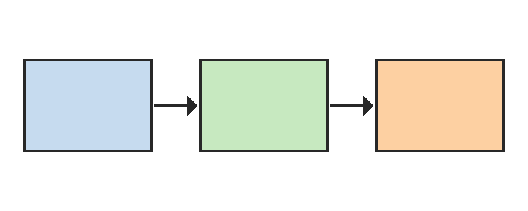

# СОДЕРЖАНИЕ

# ВВЕДЕНИЕ

Учёт заявок — типовая задача любой организации, которая принимает обращения от клиентов или сотрудников. Пока заявок немного, их ведут в таблицах, но с ростом потока такой учёт перестаёт справляться: заявки теряются, сроки нарушаются, а руководство не видит общей картины.

Цель работы — разработать веб-приложение для учёта заявок, которое позволяет регистрировать обращения, назначать исполнителей и контролировать сроки. Для достижения цели решаются следующие задачи:

- проанализировать предметную область и существующие решения;
- спроектировать архитектуру приложения;
- оценить нагрузку на систему.

Терминология документооборота в работе используется в соответствии со словарём [@varlamova2017], правила оформления отчёта — по стандарту [@gost732].

# Анализ предметной области

## Обзор существующих решений

Системы учёта заявок различаются по назначению: одни ориентированы на службы поддержки, другие — на внутренние процессы организации. Общей для них является модель жизненного цикла заявки: регистрация, назначение исполнителя, выполнение и закрытие.

Как показано на рисунке [@fig:arch], разрабатываемая система состоит из трёх модулей: клиентской части, сервера приложений и базы данных.

{#fig:arch}

Клиентская часть отвечает за ввод и просмотр заявок, сервер приложений — за бизнес-логику и права доступа, база данных — за хранение. Такое разделение упрощает сопровождение и масштабирование [@kanke2019, с. 45].

Сравнение рассмотренных решений приведено в таблице [@tbl:compare].

: Сравнение систем учёта заявок {#tbl:compare}

| Решение | Назначение | Стоимость, руб. в месяц |
|---|---|---|
| Система А | Служба поддержки | 5 000 |
| Система Б | Внутренние процессы | 3 500 |
| Разрабатываемая система | Внутренние процессы | — |

## Требования к системе

Требования к системе сформулированы с учётом нормативных документов [@law273] и опыта эксплуатации аналогов. Система должна обеспечивать:

а) регистрацию заявок с обязательными полями;
б) назначение исполнителя и контроль сроков;
в) формирование отчётов для руководства.

# Проектирование системы

## Оценка нагрузки

Среднее время ответа сервера оценивается по формуле [@eq:response]:

$$ T = \frac{1}{N} \sum_{i=1}^{N} t_i $$ {#eq:response}

где T — среднее время ответа, с;
N — число запросов за период наблюдения;
tᵢ — время ответа на i-й запрос, с.

Пропускная способность системы определяется отношением числа обработанных запросов ко времени наблюдения, а допустимая нагрузка — неравенством

$$ \lambda \le \frac{\mu}{1 + \sigma^2} $$ {#eq:load}

где λ — интенсивность поступления заявок, μ — интенсивность обслуживания, σ — коэффициент вариации времени обслуживания. Подход к анализу производительности сложных систем описан в обзоре [@gu2018].

## Выбор технологий

При выборе технологий учитывались зрелость, наличие документации и стоимость владения. Справочные сведения о присвоении идентификаторов изданиям взяты с сайта Российской книжной палаты [@isbn_order]. Исходный код модуля регистрации заявок приведён в приложении [@app:code].

# ЗАКЛЮЧЕНИЕ

В работе проанализирована предметная область, спроектирована трёхзвенная архитектура приложения и получена оценка нагрузки по формуле (1). Разработанное решение позволяет вести учёт заявок без потери обращений и контролировать сроки их выполнения.

# СПИСОК ИСПОЛЬЗОВАННЫХ ИСТОЧНИКОВ

# ПРИЛОЖЕНИЕ {#app:code}

## Листинг модуля регистрации заявок

```
def register(request):
    ticket = Ticket(title=request.title, author=request.user)
    ticket.deadline = calculate_deadline(ticket)
    ticket.save()
    return ticket
```
